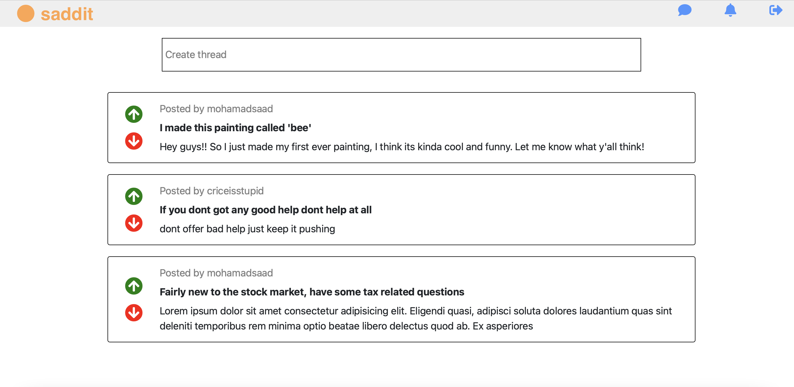
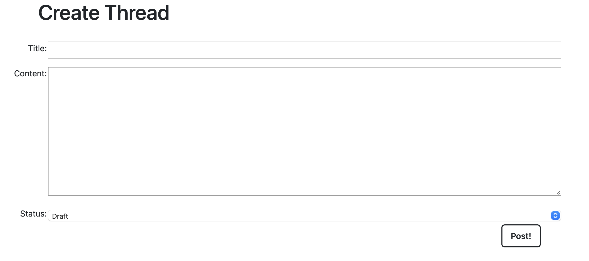

# Saadit!

Saadit is a place where you can browse through threads, view each thread's details, create a thread so that you're able to share your thoughts, questions, images etc..  with the signed up users!

 what're you waiting for, [start browsing and posting](https://saadit.herokuapp.com)  

## The website ⬇

### View all threads
 A user can view all the threads that have been posted so far, along with the user that posted it

 

### Create a thread!
 A user has the ability to create a thread

 

### Details
 A user can view any thread's details
 
 

### Edit / Delete
A user has the ability to edit/delete any thread they have posted

 

## Trello Planning
 [Trello plan](https://trello.com/b/qBnLFLwC/unit-3-project)

## Technologies Used 🖥 :
* Django
* SQL
* Python
* JavaScript
* HTML
* CSS

 ## Sources and Credits
Icons from [Font Awesome](https://fontawesome.com)  

 ## Next Steps
 * Toggle between light and dark mode
 * Ability to upvote/downvote
 * Ability to add comments
 * Ability to share/save posts
 * Ability to have Subsaadits
